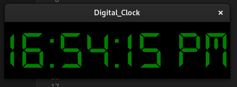

# Digital Clock with Python and Tkinter



This is a simple digital clock created using Python's Tkinter library. It displays the current time in hours, minutes, seconds, and AM/PM format.

## Features

- Displays current time in a digital format.
- Updates every second to show the accurate time.
- Customizable font, background, and text color.

## Requirements

- Python 3.x
- Tkinter library

## Installation

1. Clone the repository:

   ```bash
   git clone https://github.com/kaveesha22902/digital_clock.git


  [Source_code](code_screenshot.png) 

2.Navigate to the project directory:

   ```bash
   cd digital-clock

[Directory](directory_screenshot.png)

3.Run the script:

   ```bash
   digitalclock.py


  
